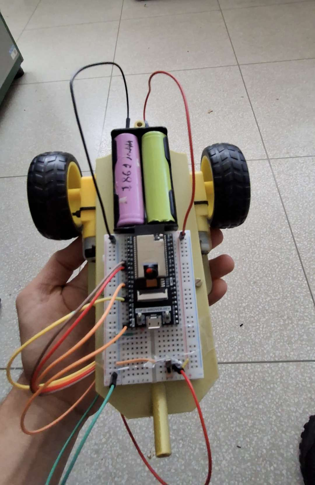

# Baloone
Repositório reservado ao robô utilizado para a divulgação do PS da TITANS.

  

  

### Composição do Baloone 🎈

- **Microcontrolador:** ESP32-WROVER-DEV 
- **Driver de motor:** Módulo de L298N
- **Motor:** 2x DC 3V-6V
- **Roda:** 2x Rodas amarelas
- **Bateria:** 2x 18650
- **Chave:** Switch comum
